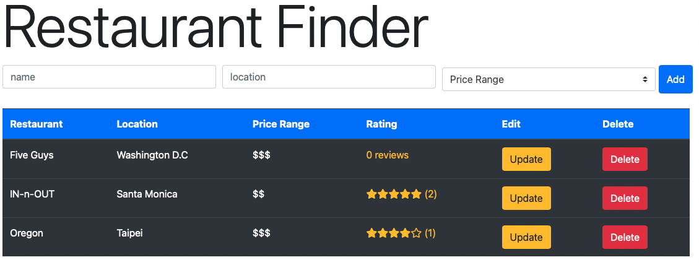
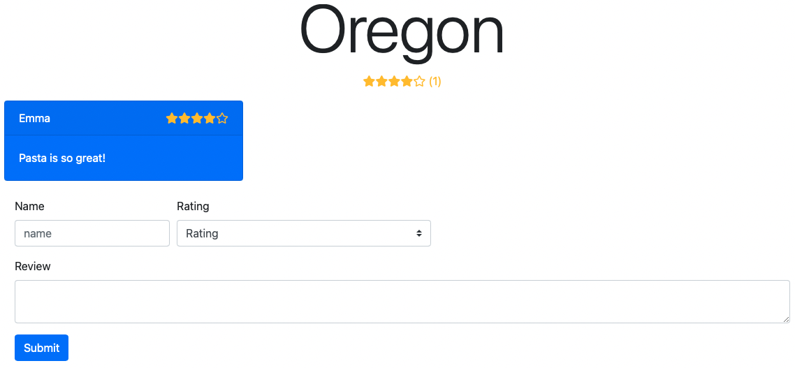

# Yelp Clone App
Yelp clone app built with React, Node.js, Express and PostgreSQL. 

## Table of contents 
* [Demo](#demo)
* [General ino](#general-info)
* [Technologies](#technologies)
* [RESTful API](#restful-api)

## Demo

Here is a working live demo : [yelp-clone-heroku.herokuapp.com](https://yelp-clone-heroku.herokuapp.com)

## General info
This project is a simple yelp clone. User can add restaurants info including restaurant name, location, and price range. User can also leave comment and rating as a review for each restaurant.

### Home page 

### Review page

## Technologies
Project is created with:
* React version: 17.0.2
* Node version: 16.13.1
* Express version: 4.17.1

## RESTful API

Below are the operations in `server.js` which follows RESTful API convention. 

| Operation           | Method | URL                               |
| ------------------- | ------ | --------------------------------- | 
| Get all restaurants | GET    | /api/v1/restaurants               |
| Get a restaurants   | GET    | /api/v1/restaurants/:id           |
| Create restaurant   | POST   | /api/v1/restaurants               |
| Update restaurant   | PUT    | /api/v1/restaurants/:id           |
| Delete restaurant   | DELETE | /api/v1/restaurants/:id           |
| Add review          | POST   | /api/v1/restaurants/:id/addReview |

## Inspiration 
This app is based on PERN Stack Mega Course from YouTube.